<h3><code>djay@github ~ $ ./contributions.sh</code></h3>

  

<h3><code>djay@github ~ $ neofetch</code></h3>

  

<h3><code>djay@github ~ $ ./trophies.sh</code></h3>

  

<h3><code>djay@github ~ $ cat about.md</code></h3>

Python backend developer based in Mumbai, building robust and scalable
applications — APIs, backend logic, and data processing pipelines. I enjoy
working with data, integrating third-party services, and optimizing server-side
performance. Always learning, always shipping. Let's build something awesome
together.

 

<h3><code>djay@github ~ $ ls stack/</code></h3>

 

 

 

  

  

<code>all art generated from my own data · refreshed daily by GitHub Actions</code>

